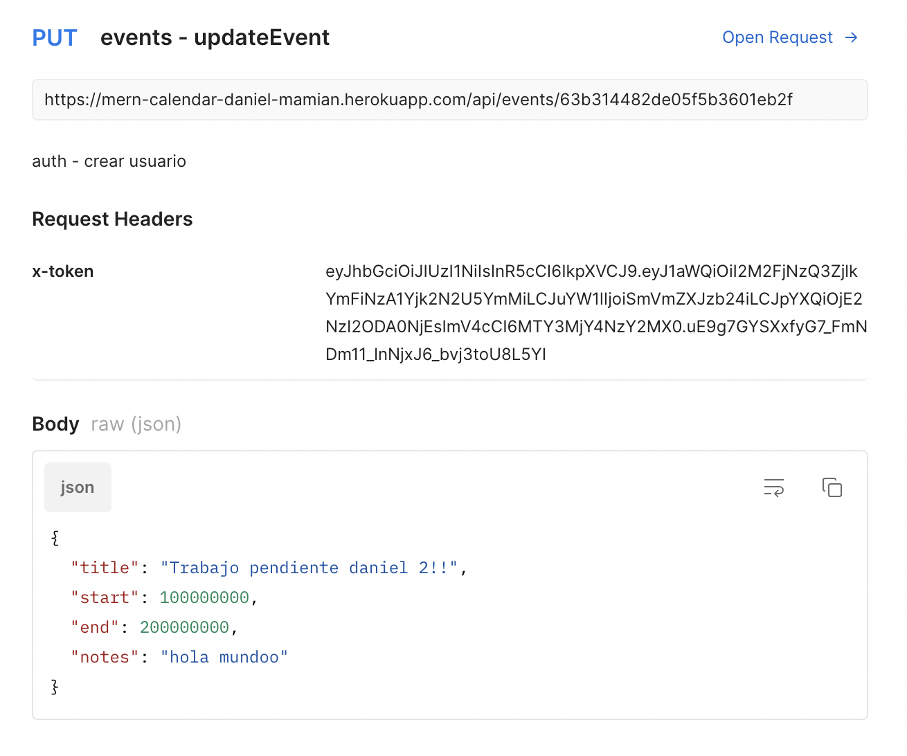
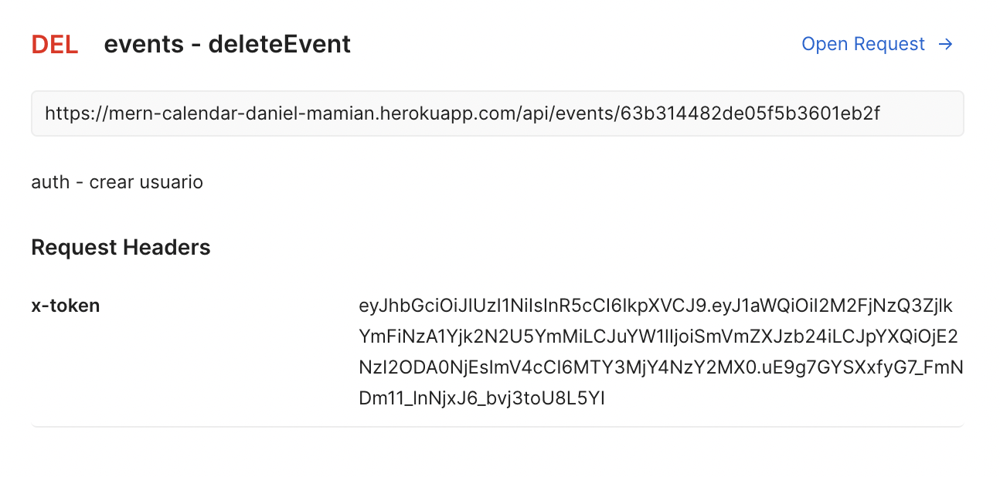
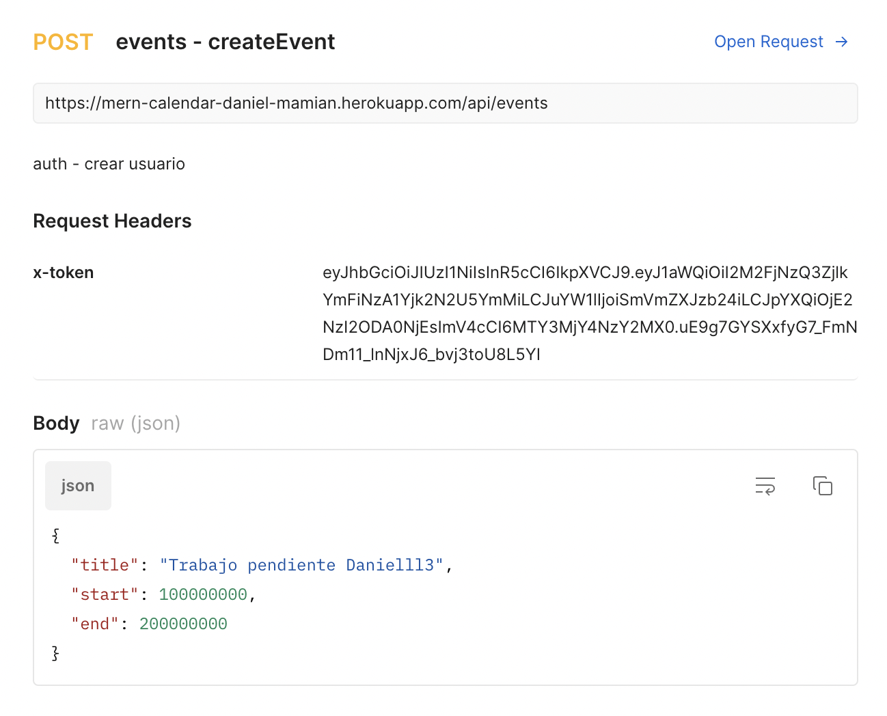
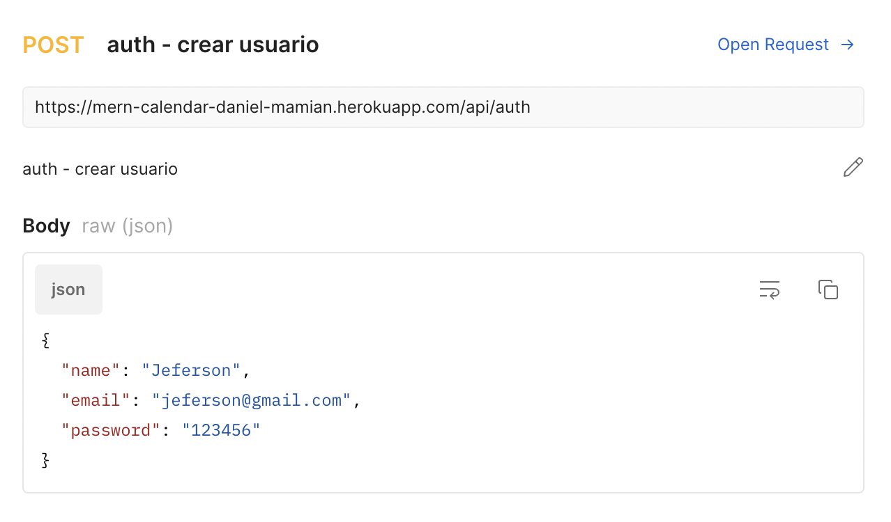
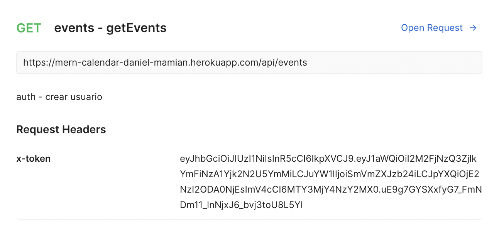
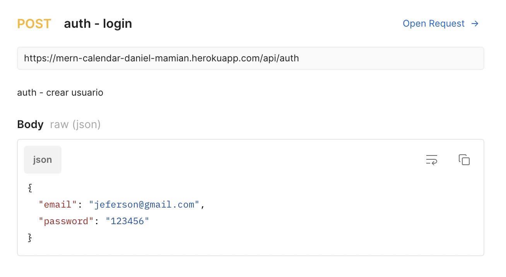
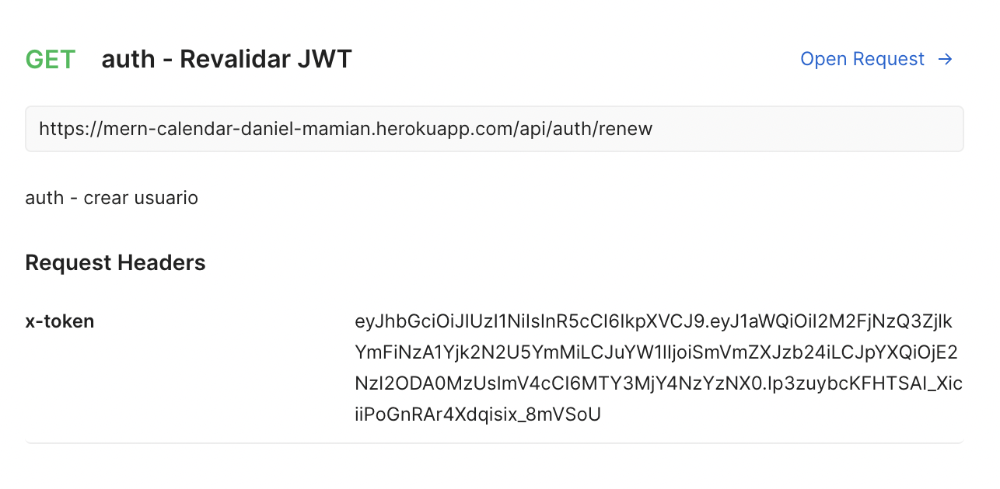

# Calendar Backend

Esta api esta diseñada para almacenar, manipular y brindar información acerca de usuarios y eventos de un calendario.

#### Api Link: https://mern-calendar-daniel-mamian.herokuapp.com/

### Routes:








### Esta creada con:

- NodeJs

- Database: MongoDB

- Framework NodeJs para el manejo de middelwares y el servidor: Express

- Framework NodeJs para el manejo de la base da datos: Mongoose

- Validación de campos: Express-validator

- Encryptación de constraseñas: Bcryptjs

- Autenticación: Json web token

- Package Manager: npm

### Como ejecutar el server
```
npm run dev
```